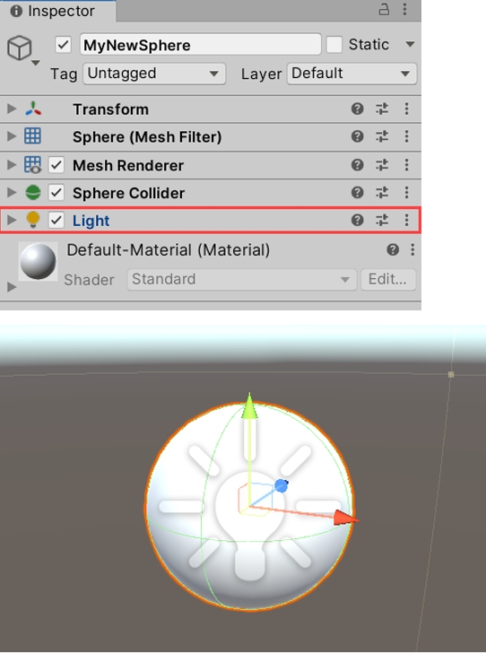
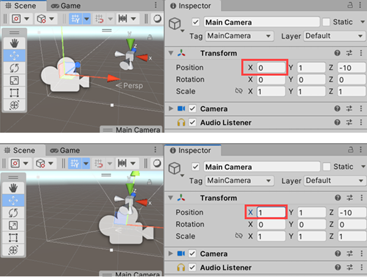
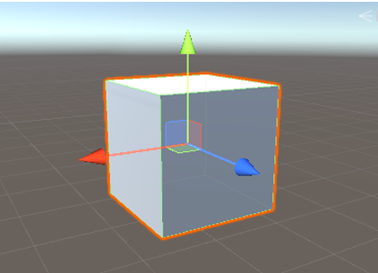

# Unity Transform Basics

## 1. Coordinate System
- Unity uses a **3D coordinate system** with **X, Y, Z** axes.  
- Object positions are defined as `(x, y, z)`.  
- Example: `(0,1,0)` means the object is **1 unit above** the origin.

---

## 2. Moving Objects
- **Inspector**: change `Transform > Position` values (X, Y, Z).  
- **Move Gizmo**:  
  - Red = X (left/right)  
  - Green = Y (up/down)  
  - Blue = Z (forward/back)  
  - Remember: **XYZ = RGB**.  
- Use **squares** between arrows to move along planes (e.g., XZ plane).  
- Delete objects with **Delete key** or right-click → *Delete*.  
- Undo with **Ctrl+Z** (Windows) / **Cmd+Z** (Mac).

---

## 3. Rotating Objects
- **Rotation Tool (E key)** → gizmo with 3 colored rings.  
  - Red = X axis, Green = Y axis, Blue = Z axis.  
- Drag a ring to rotate around that axis.  
- **Inspector**: adjust `Transform > Rotation` in degrees.  
- Inner white circle = free rotation relative to Scene view.  
- Rotation affects **local space** (arrows follow the object’s orientation).  
- Switch between **Local** and **Global** in the Scene toolbar.

---

## 4. Scaling Objects
- **Scale Tool (R key)** → gizmo with cubes at the ends.  
  - Drag a cube to scale along that axis.  
  - White cube in the center → uniform scaling (all axes).  
- **Inspector**: `Transform > Scale`.  
  - `(1,1,1)` = 100% (default size).  
  - `(2,2,2)` = 200% (double size).  
  - `(0,0,0)` = invisible.  
- Lock uniform scaling with the **chain icon** in Inspector.

---

## 5. Parenting in Unity

- Parenting links objects so children follow the parent’s **position, rotation, and scale**.  
- Example: make a Cube (Item) a child of a Capsule (Player) → the Item moves with the Player.  
- **Local Transform** shows values relative to the parent, not world space.  
- Empty GameObjects are useful as parents to organize or group parts (e.g., a Sword).  
- Complex objects (like a Sword) are built by combining children (Handle, Guard, Blade) under one parent.

---

## Summary
- **Move** → W key (arrows).  
- **Rotate** → E key (rings).  
- **Scale** → R key (cubes).  
- Transform tools are controlled through **Inspector** or **Scene gizmos**.  
- Mastering **Position, Rotation, and Scale** is the foundation of working with GameObjects.
