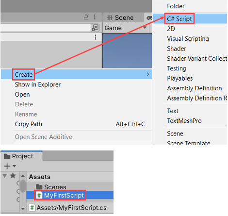
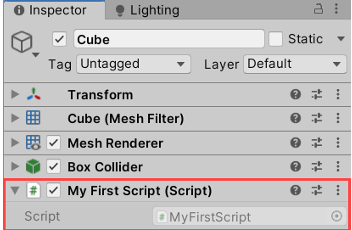
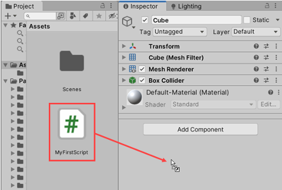

# What Is Scripting in Unity?

Scripting is the process of writing custom logic and behaviors that bring a game to life. While *scripting*, *coding*, and *programming* are often used interchangeably, in game development they all refer to writing instructions that a computer (or game engine) can execute.

In **Unity**, scripting is done in **C#**.

---

## Key Concepts

### Script as a File

A script is a **text file** containing C# code.
Its filename usually matches the class defined inside (e.g., `PlayerController.cs`).

### Script as a Component

In Unity’s architecture, a script is a **custom component**.
Like built-in components (Rigidbody, Collider), you attach your script to a GameObject to define its behavior.

**Example:**
Create `PlayerController.cs`, implement movement/jump/interaction, then attach it to the **Player** GameObject in the Inspector.

### Behavior Definition

Scripts determine how objects:

* React to input (keyboard, mouse, controller).
* Interact with physics (collisions, forces).
* Respond to game events (scoring, health).
* Communicate with other objects/components.

---

# Creating and Attaching Scripts in Unity

Scripts are treated as components. You attach them to GameObjects to give them behavior.

## How to Create a Script



1. In the **Project** window:

   * Right-click → **Create > C# Script**.
   * Name it, e.g., `MyFirstScript`.

> Unity creates a `.cs` file with a basic class inheriting from `MonoBehaviour`.

## Editing the Script

* Double-click the file to open it in your editor (Visual Studio / VS Code).
* Add methods, variables, and logic that define the GameObject’s behavior.

```csharp
using UnityEngine;

public class MyFirstScript : MonoBehaviour
{
    // Called once when the object becomes active
    void Start()
    {
        Debug.Log("Cube ready!");
    }

    // Called once per frame
    void Update()
    {
    }
}
```

## Attaching the Script




**Via Inspector**

* Select a GameObject (e.g., a Cube).
* In **Inspector**, click **Add Component** → search `MyFirstScript` → add.

**Drag & Drop**

* Drag the script from **Project** onto the GameObject’s **Inspector**.

---

# Variables in Unity (C#)

A **variable** is a container for data. You can **store**, **read**, and **change** its value.

## Common Types

* **int** → whole numbers (`150`)
* **float** → decimal numbers (`3.14f`)
* **char** → single character (`'A'`)
* **string** → text (`"Hello"`)
* **bool** → `true`/`false`
* Custom types → classes/structs you define

## Naming Style

Use **camelCase**: first word lowercase, following words uppercase (e.g., `playerHealth`, `maxSpeed`).

```csharp
void Start()
{
    int playerHealth = 100;
    Debug.Log(playerHealth); // Logs 100
}
```

---

# Other Variables (More Examples)

**float** — use `f` suffix:

```csharp
float moveSpeed = 5.25f;
```

**string** — text values:

```csharp
string playerName = "Bob";
playerName = "Tim";
```

**bool** — boolean values:

```csharp
bool gameOver = false;
gameOver = true;
```

**Combined example:**

```csharp
void Start()
{
    int playerHealth = 100;
    Debug.Log(playerHealth);

    float moveSpeed = 5.25f;
    Debug.Log(moveSpeed);

    string playerName = "Tim";
    bool gameOver = true;
}
```

---

# Operators (Unity C#)

## Addition and Plus-Equals

* `+` sums values.
* `+=` increases a variable by a value (reads current value, adds, writes back).

```csharp
int score = 0;
score += 1;   // 1
score += 5;   // 6

int a = 5, b = 2;
int c = a + b; // 7
```

## Subtraction, Multiplication, Division

```csharp
int score = 6;
score -= 2;   // 4
score *= 5;   // 20
score /= 2;   // 10

int d = a * 2; // 10
int e = d / 3; // 3
```

## Floats and Strings

```csharp
float jumpHeight = 5.2f;
jumpHeight *= 1.5f; // 7.8f

string message = "Hello " + "World" + " and everything else";
```

Use comments `//` to label code blocks and clarify intent.

---

# Conditions

Conditions evaluate to **true** or **false**, and control code flow with `if`, `else if`, `else`.

## Comparisons

* Equality / inequality: `==`, `!=`
* Ordering: `<`, `>`, `<=`, `>=`

```csharp
int score = 10;
if (score == 10)
{
    Debug.Log("Player has won!");
}

int health = 50;
if (health <= 0)
{
    Debug.Log("Player has been destroyed.");
}
else if (health > 0)
{
    Debug.Log("Player still has health");
}
```

## Logical Operators

Combine multiple conditions:

* **AND** `&&` → all conditions must be true
* **OR**  `||` → at least one condition must be true

```csharp
int age = 35;
if (age >= 30 && age < 40)
{
    Debug.Log("Age is in the thirties!");
}

int num = 2;
if (num == 1 || num == 2)
{
    Debug.Log("Success!");
}
```

---

# Functions

A **function** is a reusable block of code.
Unity event functions:

* `Start()` → called once when the object becomes active
* `Update()` → called once per frame

## Anatomy of a Function

* **Return type**: `void` (no value) or a specific type (e.g., `float`)
* **Name**: how you call it
* **Parameters**: inputs inside `()`
* **Body**: code inside `{ }`
* **return**: value to give back (for non-void functions)

Example utility function:

```csharp
float Add(float a, float b)
{
    float sum = a + b;
    return sum;
}

void Start()
{
    float number = Add(2.5f, 3.77f); // 6.27
    Debug.Log(number);
}
```

## Passing Variables as Parameters

You can pass variables (not just literals) as long as types match.

```csharp
void Start()
{
    float health = 40.0f;
    float healAmount = 10.0f;
    float newHealth = Add(health, healAmount); // 50.0f
}

float Add(float a, float b)
{
    return a + b;
}
```


