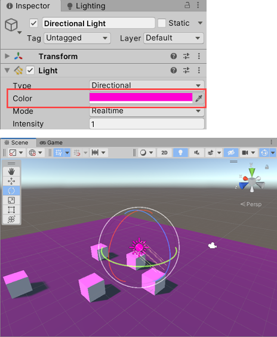
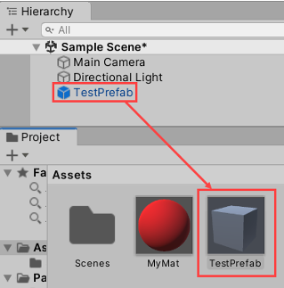
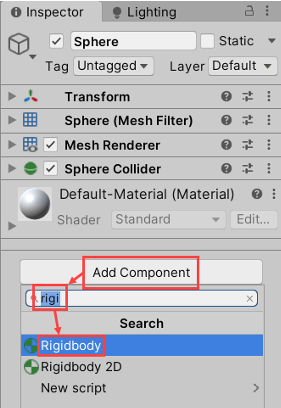
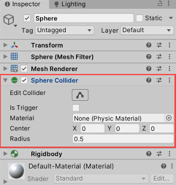

# Unity – Materials, Lights, Prefabs, and Physics

## 🎨 Materials
- Define how an object looks: **color, texture, smoothness, reflectivity, transparency**.
- Main properties:
  - **Albedo** → base color/texture.
  - **Metallic** → how much the material reflects environment vs its own color.
  - **Smoothness** → controls reflectivity (0 = matte, 1 = mirror-like).
- Apply materials via **drag & drop** on an object or set in **Mesh Renderer**.
- Transparency: set Rendering Mode to **Transparent** and adjust the **alpha channel**.

---

## 💡 Lights
- **Directional Light** → like the sun, only rotation matters.
- **Point Light** → spherical range (like a candle), properties: Color, Intensity, Range.
- **Spot Light** → cone-shaped light with adjustable angle and range.
- **Shadows**: Soft / Hard / None (impact performance).

---

## 🧩 Prefabs
- Prefabs = **templates** of GameObjects saved as assets.
- Modify the prefab → changes propagate to all its instances.
- Use the **Prefab Editor** for adding children or restructuring.
- Best practice: turn reusable objects into prefabs early.

---

## ⚙️ Physics

### Core System
- Unity’s Physics handles:
  - **Collisions**
  - **Gravity**
  - **Velocity & Forces**
  - **Friction & Drag**
  - **Inertia**
- By default, **1 Unity unit = 1 meter**, gravity ≈ **-9.81 m/s²** on Y-axis.

### Key Components
- **Rigidbody** → makes an object dynamic in the physics system.
  - Properties: Mass, Use Gravity, Drag, Angular Drag, Constraints.
  - **Drag** simulates air resistance (0 = space-like, no slowdown).
  - **Constraints** can lock position/rotation on chosen axes.
- **Collider** → defines physical shape (Sphere, Box, Capsule, Mesh).
  - Green wireframe gizmo shows collider boundaries.
  - **Is Trigger**: ignores physics collisions but fires events.

  
  
  

### Typical Setup
1. Add a **Plane** (ground).
2. Add a **Sphere** (object).
3. Add **Rigidbody** to the Sphere → it falls due to gravity.
4. Both Plane and Sphere have colliders → they collide correctly.
5. Add a **ramp** (Cube scaled/rotated) → Sphere rolls down.

### Physic Material
- Controls **friction** and **bounciness**.
- Apply via Collider → affects how surfaces slide or bounce.

