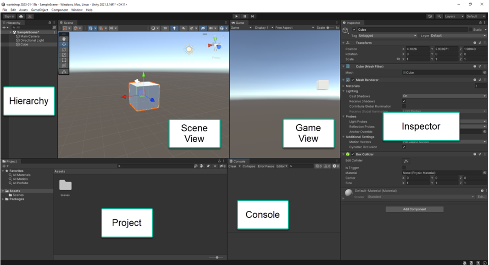
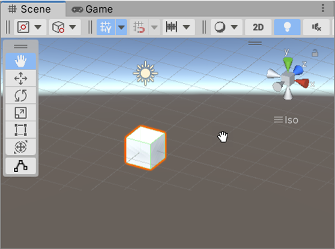

# Unity Editor

## 1. Default Layout
- When you open a project, Unity displays a standard window layout.  
- You can always restore it from **Window > Layouts > Default**.  

---

## 2. What is a Window in Unity
- A **window** is a panel with a specific function.  
- It can be **docked** into the editor or **detached**, like a normal OS window.  

---

## 3. Main Windows

- **Hierarchy** → List of all objects in the scene (e.g., Camera, Lights).  
- **Scene View** → A 3D view of the game world, where you can move and select objects.  
- **Game View** → Displays what the camera sees, i.e., the “running” game.  
- **Inspector** → Shows properties and components of the selected object; you can modify them.  
- **Project Window** → Works like a file explorer; contains folders, assets, and scenes.  
- **Console** → Displays messages, warnings, and errors from the editor or your code.  

---

## 4. Object Selection
- You can select objects from the **Hierarchy** or directly in the **Scene View** (by clicking on icons: camera, sun, etc.).  
- When selected, both **Scene View** and **Inspector** update with that object’s details.  

---

## 5. Scenes and Folders
- A **Scene** is like a level in the game.  
- In the **Project Window**, you can create new folders, import assets, or open existing scenes.  

---

## 6. Navigating in the Scene View
- **Right click + mouse** → look around (FPS style).  
- **WASD** → move horizontally.  
- **Q/E** → move down/up.  
- **Middle mouse drag** → pan the view.  

---

## 7. Interacting with Objects
- Creating a **Cube** (`3D Object > Cube`) shows it in both **Scene** and **Hierarchy**.  
- Selected objects have an **orange outline** in Scene View.  
- Pressing **F** centers the camera on the selected object.  
- The **Inspector** always displays the object’s details.  

---

## 8. Orientation Gizmo (top-right corner)
- **Y (green)** → top view.  
- **X (red)**, **Z (blue)** → side views.  
- **Cube in center** → toggles between **Perspective** and **Isometric**.  

---

## 🔑 Summary
Unity is organized into **windows/panels**, each serving a different purpose:  
- managing objects  
- editing properties  
- exploring assets  
- viewing/debugging errors  

Working with these windows together allows you to **build, visualize, and manage your game effectively**.

